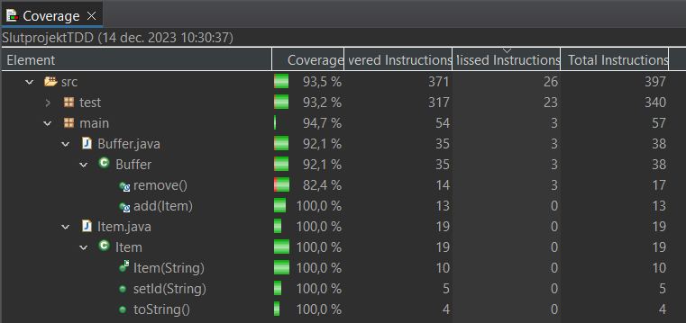

Jag spenderade den mesta delen av detta projekt med att tänka på strukturen. När jag väl hade löst hur jag ville att strukturen skulle vara och såg till att det följde instruktionerna så stötte jag på ett större problem när det gällde trådar. Det tog lång tid för mig att förstå att jag behövde starta om tråden när jag fick ett exception. Efter  jag löste det så tyckte jag att uppgiften gick ganska bra.

